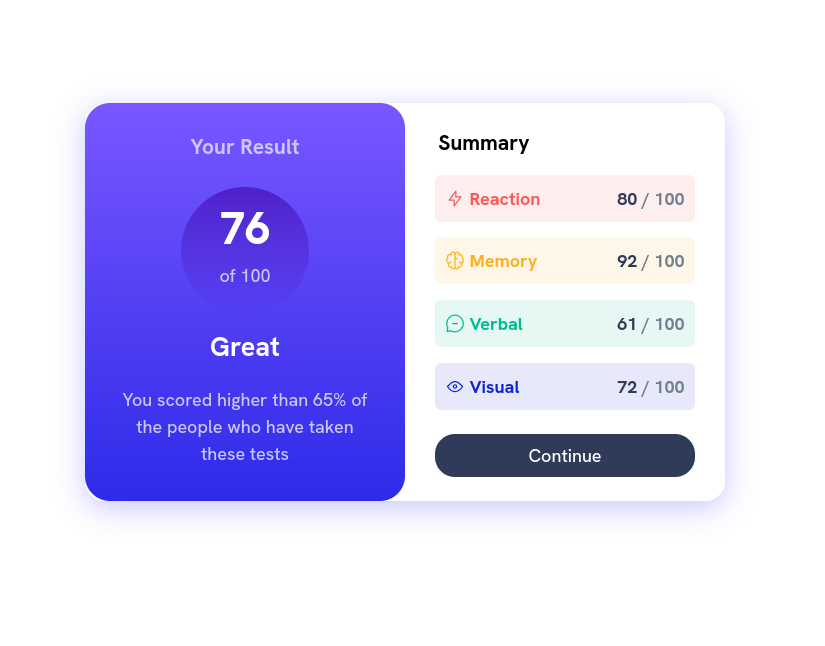

# Frontend Mentor - Results summary component solution

This is a solution to the [Results summary component challenge on Frontend Mentor](https://www.frontendmentor.io/challenges/results-summary-component-CE_K6s0maV). Frontend Mentor challenges help you improve your coding skills by building realistic projects.

## Table of contents

- [Overview](#overview)
  - [The challenge](#the-challenge)
  - [Screenshot](#screenshot)
  - [Links](#links)
- [My process](#my-process)
  - [Built with](#built-with)
  - [What I learned](#what-i-learned)
- [Author](#author)
- [Acknowledgments](#acknowledgments)

## Overview

This is my second Frontend mentor challenge and it floored me even though I thought it was easy at first. Then I kept going and when I was abou to finish it actually felt a lot easier. Software Development in a nutshell (there's no knowing how it goes so keep at it).

### The challenge

Users should be able to:

- View the optimal layout for the interface depending on their device's screen size
- See hover and focus states for all interactive elements on the page
- **Bonus**: Use the local JSON data to dynamically populate the content (I did not do this because I went for vanilla)

### Screenshot

### Links

- Solution URL: [github](https://github.com/harrisfoes/result-summary)
- Live Site URL: [here](https://harrisfoes.github.io/result-summary/)

## My process

### Built with

- Semantic HTML5 markup
- CSS custom properties
- Flexbox
- Mobile-first workflow

### What I learned

This is the first time I was able to use a media query to dynamically change the column width of the elements. This was also my first time using gradients.

Looking forward to learn more about these topics on the next challenges

## Author

- Website - [Harris Escalante](https://harrisfoes.github.io/portfolio-page/)
- Frontend Mentor - [@harrisfoes](https://www.frontendmentor.io/profile/harrisfoes)

## Acknowledgments

Thanks to frontendmentor.io
